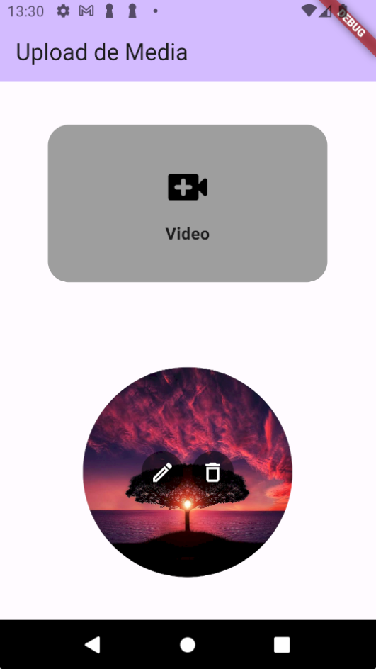
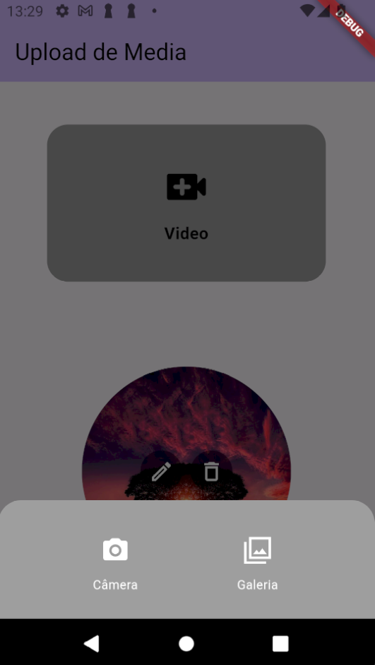

# jera_media_picker




## Brick para gerar a implementação do Media Picker

O módulo gera os 5 aquivos que é um `components/media_picker/` e outro é um `helper/local_media_picker.dart` que pode ser usado para fazer upload de video/foto pegando da galeria/câmera.<br>

## Como instalar e gerar os arquivos

Para utilizar da brick adicione ela ao seu mason.yaml com o nome jera_remote_config.

```bash
$ mason add jera_media_picker
```

Logo após adicionar rode o comando para gerar os arquivos dentro de seu projeto no diretório desejado exemplo:

```bash
$ mason make jera_media_picker -o lib/
```

Note que o que vem depois do -o é o path no qual você gostaria de adicionar essa funcionalidade.

Após isso os arquivos serão gerados e as dependencias instaladas.

## Dependencias do modulo

Ao criar os arquivos da implementação será necessário fazer o que está na documentação [image_picker](https://pub.dev/packages/image_picker) para utilização correta da package no android e iOS.<br>


## A sua parte na brick

Esse módulo apenas gera a implementação em si que pode e deve ser alterada de acordo com a necessidade e o padrão do projeto.
