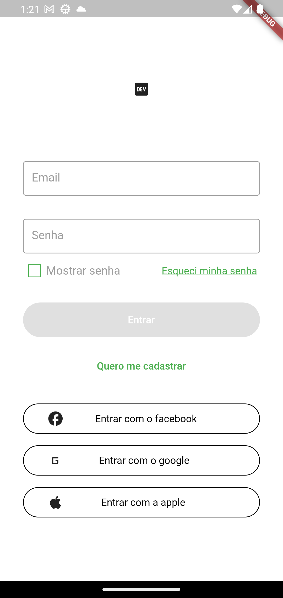
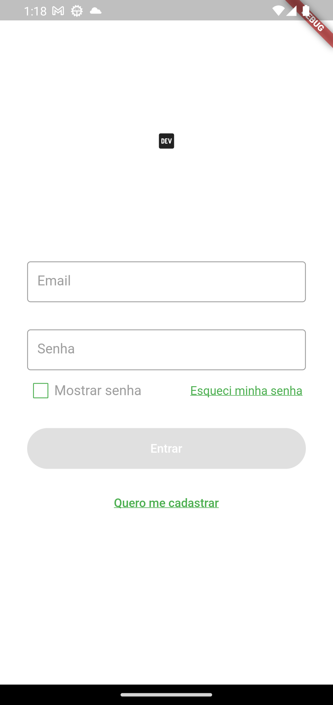

# Brick de Login com Rede Social

Brick de fazer **Login** e **Login com as redes social Apple, Google e FaceBook**.

Este módulo pede alguns condicionais que refletem nos arquivos gerados e no layout que ja vem pré estabelecido sendo simples para nortear o seu desenvolvimento. <br>
Para quando você aceita os condicionais de integração com rede social dessa forma:


Será gerado o seguinte template de layout para o login:



Ja para a opção de gerar sem a integação de redes sociais:


Temos o seguinte design: <br>


Reforço que todos os botões de login com rede social e seus respectivos use_cases e routes são opcionais e caso queira apenas 1 das integrações todo o código e import de bibliotecas não será adicionado ao módulo e o layout será modificado com apenas 1 dos botões da rede social.

## Dependências do módulo

O modulo não funciona por si só, ele precisa de algumas configurações e arquivos que utilizamos em todos os nossos projetos na Jera. Esses arquivos são:

- `APIProvider.dart`
- `Endpoint.dart`
- `MobileRouter.dart`
- `login_module.dart`

No caso das aplicações que utilizaram de serviços de integração com rede social será necessário executar todo o setup no painel do `firebase` e/ou serviços externos como `facebook developer` `apple developer` para o funcionamento adequado da funcionalidade, o módulo apenas gera a implementação desses recursos.

## Como instalar e gerar os arquivos

Para utilizar da brick adicione ela ao seu `mason.yaml` com o nome `jera_login`.

```bash
$ mason add jera_login
```

Logo após adicionar rode o comando para gerar os arquivos dentro de seu projeto:

```bash
$ mason make jera_login -o lib/features
```

**_Note que o que vem depois do `-o` é o path no qual você gostaria de adicionar essa funcionalidade._**

## Adicionar códigos ao `MobileRouter`

Nessa versão da brick optamos por não adicionar o mobile router por não saber como só adicionar o código ao arquivo existente.

Então quando você for adicionar o login dentro do seu projeto e tentar navegar você receberá um erro pois faltará declarar as instâncias do `MobileRouter`.

Segue o código que deve ser adicionado ao `MobileRouter`:

### Adicione o login as suas rotas em seu router
```dart
@override
void registerDependencies() {
  ServiceLocator.registerLazySingleton<UserRoutesProtocol>(UserRoutes.new);
}
```

```dart
static final GoRouter router = GoRouter(
    navigatorKey: rootNavigatorKey,
    initialLocation: loginRoute,
    routes: <RouteBase>[
      GoRoute(
        path: loginRoute,
        name: loginRoute,
        builder: (_, __) => const LoginView(),
      ),
    ],
  );
```

## A sua parte na brick

Esse módulo de Auth é uma base para a sua funcionalidade para otimizar o seu tempo. Porém precisará que você preencha algumas informações que será muito especifica do seu contexto. Então dentro do código estão alguns `TODO`s que você precisa resolvê-los.

### É necessário adicionar a sua classe UserRoutes dentro do seu arquivo de registro de rotas com o ServiceLocator. Segue um exemplo de código:

```dart
class RoutesModule extends AppModule {
  @override
  void registerDependencies() {
    ServiceLocator.registerLazySingleton<UserRoutesProtocol>(UserRoutes.new);
  }
}
```

### Também será preciso registrar a sua classe de SessionManager, geralmente fazemos isso em uma classe chamada "CommonsModule" onde registra-se os Singletons e LazySingletons, segue um trecho de código:

```dart
class CommonsModule extends AppModule {
  @override
  void registerDependencies() {
    ///Lazy Singletons
    ServiceLocator.registerLazySingleton<SessionManagerProtocol>(SessionManager.new);
  }
}
```

### Lembre-se de inicializar o seu módulo dentro da sua classe do ServiceLocator:
```dart
void initializeDependencies() {
  final appModules = <AppModule>[
    LoginModule(),
    RoutesModule(),
  ];

  for (final module in appModules) {
    module.registerDependencies();
  }
}
```
## Como usar?

Após resolver todos os TODO's e adicionar todos os códigos que precisa, é só você estilizar suas telas de acordo com a necessidade e estará pronto para o uso.
Podendo ser executado de acordo com o seu contexto.\*\*

_Lembre-se de se certificar que a API de seu projeto está condizente com o arquivo `user_routes.dart` e suporta todas as formas de autenticação e que a rota já exista e esteja funcionando._
