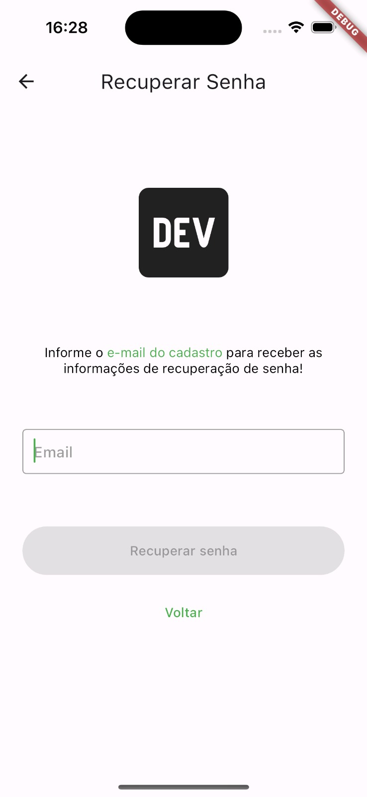
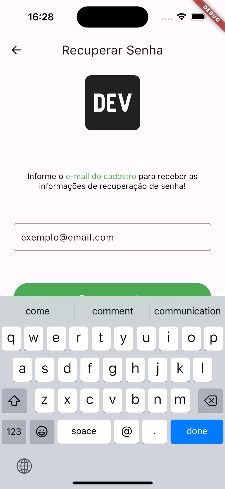

# Brick de Recuperar Senha

Esta é uma Brick projetada para acelerar a implementação da feature de **recuperação de senha** em seu projeto.




## Como instalar e gerar os arquivos

Para integrar este Brick ao seu projeto, adicione-o ao seu arquivo `mason.yaml` com o nome `jera_recover_password`.

```bash
mason add jera_recover_password
```

Após adicionar, execute o seguinte comando para gerar os arquivos em seu projeto:

```bash
mason make jera_recover_password -o lib/features
```

*Observe que o que vem após o -o é o caminho no qual você deseja adicionar essa funcionalidade.*

## Dependências do módulo

Este módulo não opera de forma independente; ele requer algumas configurações e arquivos padrão que utilizamos em todos os nossos projetos na Jera. Esses arquivos são:

- `endpoint.dart`
- `api_provider.dart`
- `service_locator.dart`

No arquivo service_locator.dart, certifique-se de adicionar o RecoverPasswordModule() como mostrado abaixo:

```dart
void initializeDependencies() {
  final appModules = <AppModule>[
    ...
    RegisterModule(),
    ...
  ];
    ...
}
```

## Personalização e Ajustes na Implementação da Brick

Este módulo de recuperação de senha oferece uma estrutura base para otimizar seu tempo. Contudo, é crucial realizar personalizações e ajustes na implementação para garantir que a funcionalidade atenda às necessidades específicas do seu projeto.

