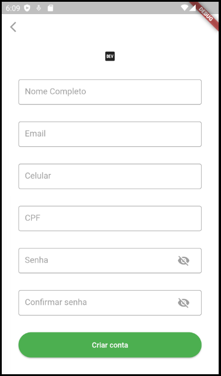

# Brick de Cadastro

Brick de um cadastro genérico que contém Nome, Email, Telefone celular, Documento(CPF), Senha e Confirmação de senha. Como no seguinte layout



# Como instalar e gerar os arquivos

Para utilizar esta brick adicione ela ao seu `mason.yaml` com o nome `jera_register`.

```bash
$ mason add jera_register
```

Para gerar o código em uma pasta determinada rode o comando com o destino que desejar como no exemplo abaixo:

```bash
$ mason make jera_register -o lib/features/authentication
```

Dessa forma o código será gerado dentro da pasta authentication do seu projeto. Caso queria gerar em outro lugar basta especificar depois do `-o`.

# Dependências do módulo

O módulo não funciona por si só, ele precisa de algumas configurações e arquivos que utilizamos em todos os nossos projetos na Jera. Esses arquivos são:

- `MobileRouter.dart`
- `service_locator.dart`

No `MobileRouter.dart` adicione a navegação para a tela de Cadastro como no exemplo a baixo utilizando GoRouter:

```dart
class MobileRouter {
  ...
  static const String register = '/register';

  static final GoRouter router = GoRouter(
    ...
    routes: <RouteBase>[
      ...
      GoRoute(
        path: register,
        name: register,
        builder: (_, __) => const RegisterView(),
      ),
      ...
    ],
  );
}
```

No `service_locator.dart` lembre de adicionar o `RegisterModule()` como exemplificado abaixo: 

```dart
void initializeDependencies() {
  final appModules = <AppModule>[
    ...
    RegisterModule(),
    ...
  ];
    ...
}
```

# Sua parte na brick
Este módulo de cadastro é uma base para a sua funcionalidade para otimizar o seu tempo. Porém lembre de colocar todos os trechos de códigos nescessários para ter o funcionamento perfeitamente. Além de alinhar com a API de seu projeto para saber se está condizente as requests e rotas no arquivo `register_routes.dart`.