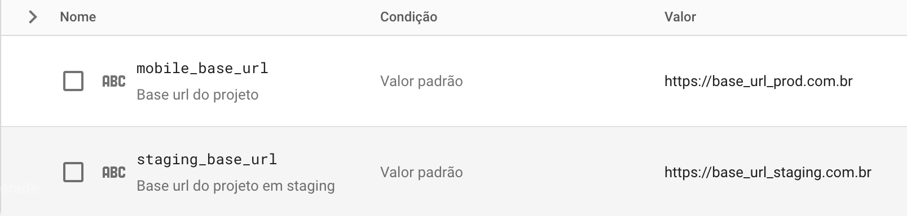

# Jera Remote Config brick.

## Brick para gerar a implementação do remote config

O módulo gera os dois aquivos que atualmente utilizamos para fazer a implementação de remote config nos projetos o `remote_config_provider.dart` e `remote_config_values.dart` que são necessários para recuperar as informações do remote config.<br>

## Como instalar e gerar os arquivos

Para utilizar da brick adicione ela ao seu mason.yaml com o nome jera_push.

```bash
$ mason add jera_remote_config
```

Logo após adicionar rode o comando para gerar os arquivos dentro de seu projeto no diretório desejado exemplo:

```bash
$ mason make jera_remote_config -o lib/support
```

Note que o que vem depois do -o é o path no qual você gostaria de adicionar essa funcionalidade.

Após isso os arquivos serão gerados e as dependencias instaladas.

## Dependencias do modulo

Ao criar os arquivos da implementação do remote config será necessário inicializar a instância da sua classe para utilizar o provider das informações cadastradas do seu app.<br>
Segue o código de exemplo inicializando a classe do Remote Config Provider:

```dart
final remoteConfig = RemoteConfigProvider.instance;
remoteConfig.initialize();
```

Também é importante notar que as informações buscadas dependem das informações cadastradas no remote config no painel do firebase, e são segmentadas por `produção` e `staging` de acordo com o prefixo da key sendo eles respectivamente `mobile` e `staging` portanto todos os valores a serem adicionados no remote config deve seguir esse padrão de key para o funcionamento adequado da aplicação, segue um exemplo:

   
<br>

## A sua parte na brick

Esse módulo apenas gera a implementação em si que pode e deve ser alterada de acordo com a necessidade e o padrão do projeto, caso o setup do firebase não for concluido e as variáveis não forem criadas no painel do remote config seguindo o padrão descrito não irá funcionar corretamente.
