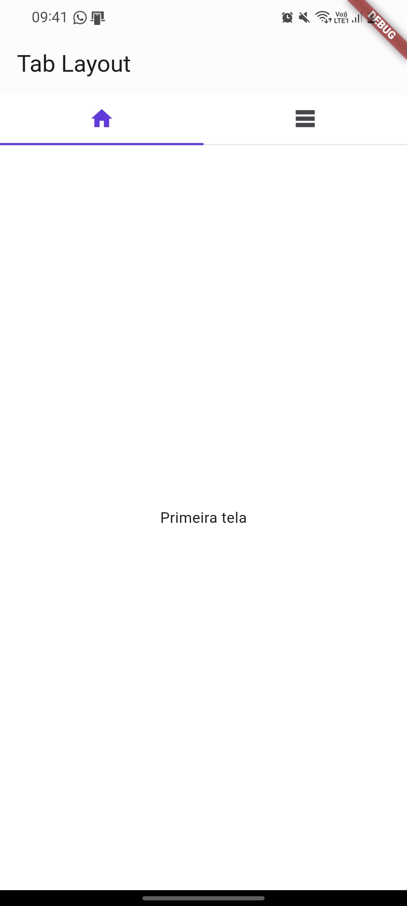

# "Tab Layout" Brick

Uma brick para criar um layout com ``Tab Layout`` no seu projeto. Essa tela compreende uma AppBar, um menu de seleção (TabBar) e o conteúdo associado a cada item selecionado.

> Brick para criar uma feature de "Tab Layout",  com arquivos desenvolvidos no padrão atualmente adotado pela Jera.



## 🗺️ Guia de Instalação e Geração de Arquivos

Para integrar a brick, adicione-a ao seu arquivo `mason.yaml` utilizando o nome `jera_tab_layout`.

```bash
mason add jera_tab_layout
```

Após a adição, execute o comando para gerar os arquivos em seu projeto:

```bash
mason make jera_tab_layout -o lib/features
```

Observe que o que segue após o `-o` é o caminho no qual você deseja adicionar a pasta com a feature de `tab_layout`.

## 🤔 Quais são as pendências?

Esta brick foi projetada para agilizar o desenvolvimento da funcionalidade 'Tab Layout', apresentando um layout genérico. No entanto, é necessário revisar e personalizar os arquivos de acordo com o padrão do seu projeto, incluindo:

- Modificação da appBar
- Adaptação de textos
- Ajustes de cores
- Personalização da TabBar
- Adição do conteúdo dentro de cada item da TabBar selecionada

Para facilitar, adicionamos `TODOs` pela feature relacionadas a essa tarefa.
